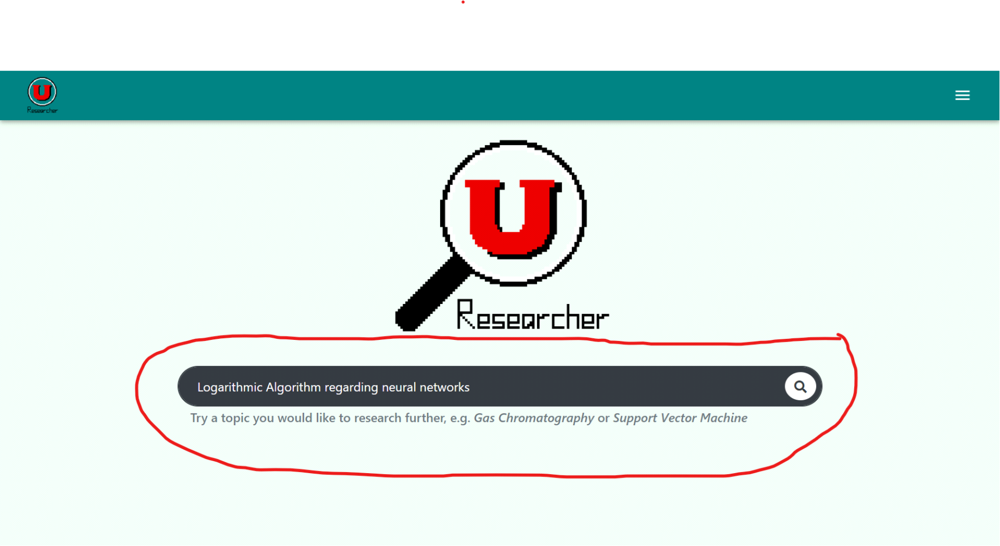
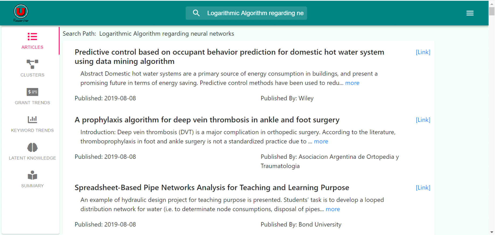
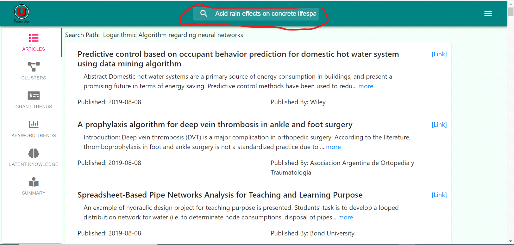
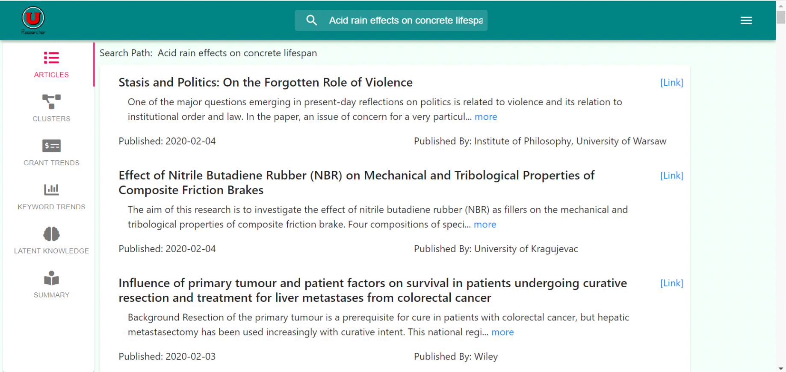
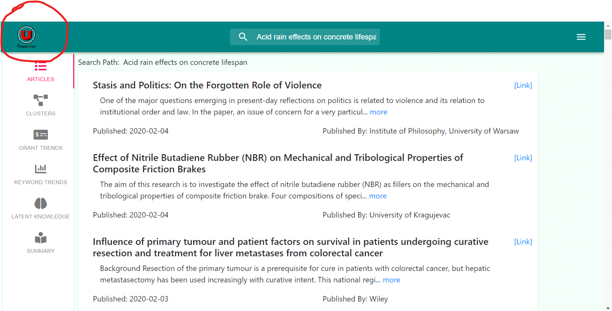
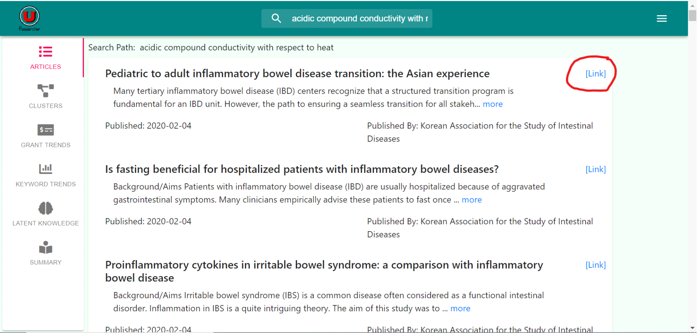
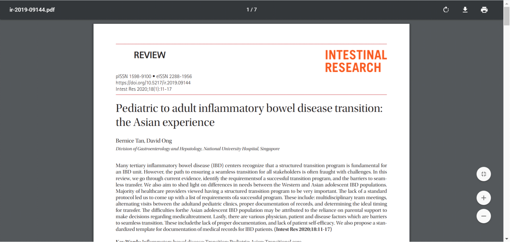

# Using the Article Search

1. Search-bar page:
    * Type in the desired topic in the search bar
    
    
    
    * Click on the magnifying glass or hit enter to begin the search.
    
    
	
    * Wait for the web page to load the results.
    
2. Search From Results Page
    * Type in the desired topic in the search bar at the top of the page.
	
	
	
    * Click on the magnifying glass or hit enter to begin the search.
    * Wait for the web page to load the results.
	
	

3. Restarting a search
    * Click on the logo in the upper left-hand corner or refresh the home page.
    
	

4. Following Research Papers

	* Click on the link next to the desired research article.
    
    
    
    * Wait for the application to redirect to the web page
    
    
	
