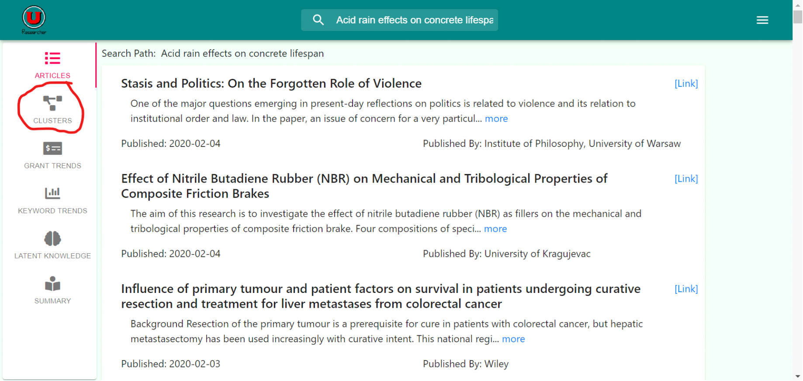
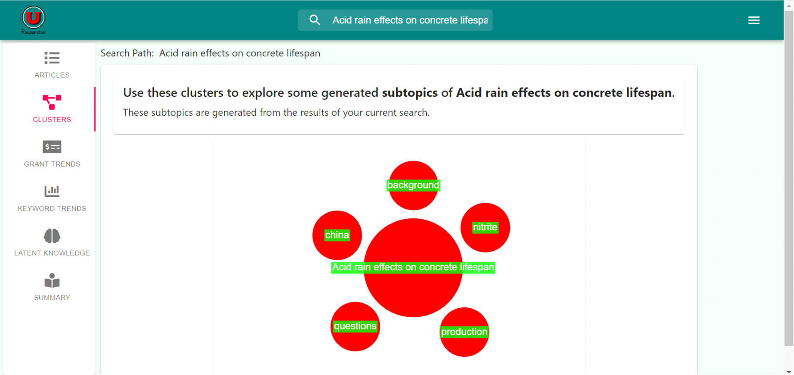

# Using The Clusters

1. Examining Clusters
    * After a successful search, click on the “Clusters” side panel.
    
    
    
    * Wait for The Clustering To load from the Search
    
    
    
    * Click on a cluster to begin a search with the cluster key word within the established search results.

2. Meaning of A Cluster
    * The clusters of this web application represent the commonly categorized topics within the searched field.
    * For example, given the search “acid rain effects on concrete lifespan,” the program determines that all papers within this topic can be categorized into “china,” “background,” “nitrite,” “production,” and “questions.”
    * Clicking on a cluster will create a search within both the original search and the chosen cluster topic.

# Developer Documentation

*  ### readFromListToIgnore()

 **Parameters:** None
 
 **Returns:** A map of all the names to ignore.
 
 **Description:** This function reads the list of all the names, puts it into dictionary and returns it.
 
 
*  ### stemmingNoun(allNouns)

**Parameters:** List of all the nouns.

**Returns:** List of all nouns after stemming.

**Description:** This funtion takes list of all nouns stems it and returns the list of all the stemmed nouns.

*  ### withoutStemmingNoun(allNouns)

**Parameters:** List of all the nouns.

**Returns:** List of all nouns without stemming.

**Description:** This funtion takes list of all nouns stems it and returns the list of all the non stemmed nouns.

*  ### countFrequency(allNouns)

**Parameters:** List of all the nouns.

**Returns:** A map of all the nouns as a key with frequency as a value.

**Description:** This list takes the list of all the nouns and returns the frequency of all the nouns as a dictionary.

*  ### returnTopTenClusters(frequency)

**Parameters:** frequecy map of all nouns.

**Returns:** top ten cluster frequency label.

**Description:** Takes the map of all the nouns with frequency and returns the top ten.

*  ### getClusterLabel(cluters)

**Parameters:** takes in clusters as a map.

**Returns:** Null if no cluters are made, top ten clusters and labels otherwise.

**Description:** This function performs majority of the operation from creating clusters to gernating cluster labels.

*  ### make_clusters(cluters)

**Parameters:** takes in clusters as a map.

**Returns:** Null if no cluters are made, top ten clusters.

**Description:** This function transforms articles into vector, then performs dimensionality reduction and then perform k means clustering to make clusters.

