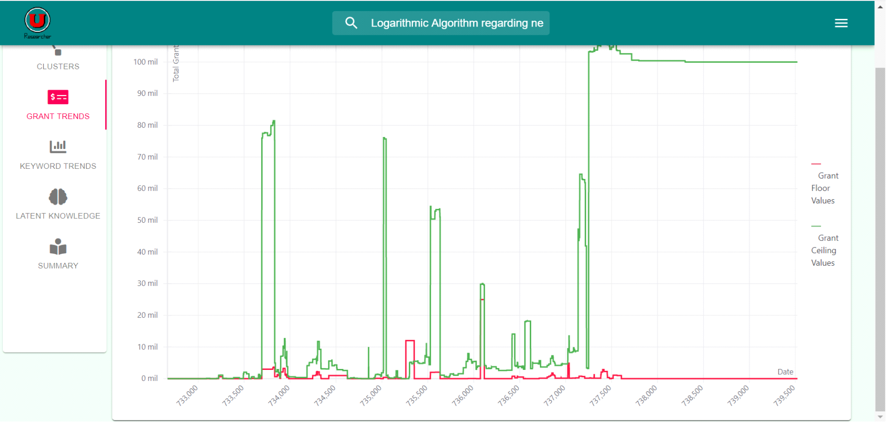

# Using Grant Analysis

1. Examine Graphs of Grants
    * Click on the “Grant Trends” side panel.
    
    
    
    * Wait for the graphs to load.
    
    
    
2. Interpreting the Graph
    * The graph consists of grant allocations from “grants.gov.”
    * Each data point represents the sum of grant values for either the floor or ceiling at a point in time.
    * The x-axis measures time; while, the y-axis measures the award response in millions of dollars.

# Developer Documentation

Author: Christopher Allan Liu
Updated by: 4/15/2020

File Location: ureasercher_app/modules/grant_anlysis.py

WARNINGS:

	- The xml module is not secure against malicious data.

Imported Libraries:

	- xml
	- re

Functions:

+ read_xml(document_name, cutoff_date)

Description: read_xml takes in a string of the name of the xml document and scans the document for pertinent information, and any posted grant information before cutoff_date is ignored. The function then stores the relevant information as a dictionary of a dictionary to return to the user.

@param1: string
@param2: datetime
@return: dictionary {string : dictionary {string : string, string : string, string : int, string : int, string : int}

Return Example: {"Research" : {"Description" : "This is a grant.", "Post" : "01012020", "Ceiling" : 10000 , "Floor" : 1000 , "Total" : 50000}}

Notes:
- Post is a date in the form of "MMDDYYYY"
- Post may be None
- Ceiling, Floor, and Total are valued with respect to US Dollars
- The document_name parameter must be a valid path

+ get_grant_data_points(grants_dictionary)

Description: This function takes in a dictionary of grant information and returns two dictionaries. The first returned dictionary gives dates with respect to the sum of award floors; while, the second dictionary provides dates with respect tothe sum of award floors.

@param 1: list dictionary {string : string, string : string, string : int, string : int, string : int}
@return1: dictionary {string : int}
@return2: dictionary {string : int}

Return Example: {"10102020" : 5000, "10112020": 100000}, {"10102020" : 1000, "10112020": 2000}

Notes:
- Some grants lack information regarding award ceilings and/or floors
- The key, or date, is of the form "MMDDYYYY"
- The elements are valued in US dolllars

+ complete_analysis(data)

Description: This function takes in a dictionary of grants and returns two lists,
which indicate trends in funding over time.  The first list gives the award
floor coordinates in the form of {x,y}; while, the second list provides 
the award ceiling in the form of {x,y}.

@param1: list dictionary {string : string, string : string, string : int, string : int, string : int}
@return1: list [dictionary {'x': Number, 'y' : Number}](floor)
@return2: list [dictionary {'x': Number, 'y' : Number}](ceiling)

Return Example: [{'x':1, 'y':2}], [{'x':1, 'y':3}]

Notes
- Some grants lack information regarding award ceilings and/or floors
- The key, or date, is of the form "MMDDYYYY"
- The elements are valued in US dolllars

+ download_grant_info(date)

Description: This function takes in a string of a properly formatted date
and downloads the .xml file of the grant records for the specified date.

@param1: String ('YYYYMMDD')
@return: None

Notes
- Grants.gov only keeps .xml files fo grants over the few past days. Do not attempt to  retrieve files
further back in time.
- The proper format of the date is "YYYYMMDD".  Single digit months and days must have a preceding zero.
- The function will automatically delete the downloaded zip file upon completion.
- The downloaded xml will be in the same directory as the grant_analysis.py.

+ grant_update(cutoff_date)

Description: This function takes in a datetime, cutoff_date, and returns a dictionary of dictionaries
of grant information such that the post dates of the grants are after the datetime.

@param1: datetime
@return: dictionary {string : dictionary {string : string, string : string, string : int, string : int, string : int}]

Return Example: {"Research" : {"Description" : "This is a grant.", "Post" : "01012020", "Ceiling" : 10000 , "Floor" : 1000 , "Total" : 50000}}

+ daily_update()

Descpription: This function returns a dictionary of dictioneries of grants that 
were posted over the past day.

@return: dictionary {string : dictionary {string : string, string : string, string : int, string : int, string : int}]

Return Example: {"Research" : {"Description" : "This is a grant.", "Post" : "01012020", "Ceiling" : 10000 , "Floor" : 1000 , "Total" : 50000}}

+ comlete_update()

Descpription: This function returns the a dictionary of dictionaries of grants
that are currently on the grants.gov website.

@return: dictionary {string : dictionary {string : string, string : string, string : int, string : int, string : int}]

Return Example: {"Research" : {"Description" : "This is a grant.", "Post" : "01012020", "Ceiling" : 10000 , "Floor" : 1000 , "Total" : 50000}}

Citations:

 	1. https://docs.python.org/2/library/xml.etree.elementtree.html

    Date Accessed: 1/16/20

    Lines: 16-74

    2. https://stackabuse.com/download-files-with-python/

	Date Accessed: 2/11/20

	Lines: 79-83
