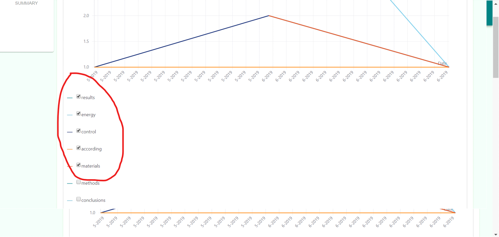

# Using Keyword Analysis

1. Examine Graphs of Keywords
    * Click on the “Keyword Trends” side panel from the results page.
    
    
    
    * Wait for the graphs to load.
    
    

2. Choosing Keywords To Graph
    * Choose keywords to include/exclude in the graph.

    
    
	
    * Wait for system to update graph.
    
	
2. Interpreting the Graph
    * The graph uses keywords analyzed from the DOAJ to represent the frequency of keywords with respect time.
    * The legend below the graph indicates which line connects to which keyword.
    * The x-axis represents time; while the y-axis measures the frequency, number of times on average the indicated word appears in a paper.

# Developer Documentation

*  ### generate_new_keywords(articles)

 **Parameters:** A list of articles
 
 **Returns:** The list of articles that were passed in, only now they have the updated keyword field.
 
 **Description:** This function is used to generate keywords for an article, the generated keywords will
 be appeneded to the existing(if there are any) keywords, and it will test for redundancy to avoid duplicates.
 
 
*  ### get_keywords(articles)

**Parameters:** A list of articles

**Returns:** A dictionary, where the key is a given keyword(STRING), and its 
value is a list of dictionaries where the dictionaries represent a date and 
and how often the keyword occurred for that date. So
KEYWORD->[{DATE1-FREQ1},{DATE2:FREQ2}....]

**Description:** This function is used to gather all keywords and corresponding 
dates for a given article search. 