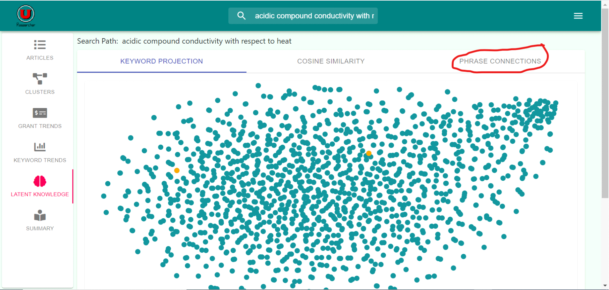

# Using Latent Knowledge Analysis

1. Accessing Latent Knowledge Analysis
    * Click on the “Latent Knowledge” side panel from the results page.
    
    
    
    * Wait for the results to load.(May take several moments.)
    
    
	
    * Access the graph from the Latent Knowledge page at any time by clicking the keyword projection tab
	
    

2. Isolating Specific Data Points
    * Click on the “Target Word(s)” bar to show a list of available words selection.

    
	
    * Select any desired words to isolate
    * Clink the “Find” button to select and isolate the words on the graph.
	
    
	
3. Interpreting Keyword Projection
    * The graph uses words from the articles in the search results.
    * Each point represents a word of interest in the search topic.
    * The closer the words are located on the graph, the more likely the words are related, by context or meaning.

4. Accessing Cosine Similarity
    * Click on the “Cosine Similarity” tab on the Latent Knowledge results page.

    	
	
    * Wait for the results to load.

    
	
5. Using Cosine Similarity
    * From the “Cosine Similarity” tab, click on the “Target Word” to show a list of words to analyze.
	
    
	
    * Select a word to a analyze and hit the Analyze button.
    * Wait for the results to load.
	
	
	
6. Interpreting Cosine Similarity Results
    * The list consists of phrases and words found within the article search space.
    * The list shows the rating of connections of words to the target word under “similarity.”.
    * If a word located higher on the list than another word, it has a greater similarity than that word.
	
7. Accessing Phrase Connections	
    * Click on the “Phrase Connection” tab on the Latent Knowledge results page.
	
    
	
    * Wait for the results to load.

    	
	
8. Using Phrase Connections
    * Select a primary topic and related topics of interest, to compare.
	
	
	
    * Choose the number of connections you wish to see between topics.
	
	
	
    * Click on “Evaluate” and wait for the result to load.
	
	
	
9. Interpreting Phrase Connection Results
    * The nodes on the graph originate from the pool of keywords from the articles from search results.
    * Each node between the primary topic and related topic represents a connection between the topics.
    * Connections will generate that number of most common link words.

# Developer Documentation

*  ### get_wordvecs(articles)

**Parameters:** Articles List Object 

**Return:** Returns all the word vectors from the newly trained Word2Vec Model 

**Description:** This function is where the model is trained on the article 
data and where pre-processing and parsing of the text occurs. What we get back 
is the resulting word vectors 

*  ### get_2d_projection(vectors)

**Parameters:** Word Vectors (EG:word vectors retrieved from get_wordvecs) 

**Return:** The t-SNE(t-distributed Stochastic neighbor embedding) projection 
of the word vectors. 

**Description:** Calculates the t-sne of the word vectors. The idea is this will
reduce high dimensional objects to a 2d form where closely modeled objects
are the most similar, making visualization of related words/phrases easy. 

*  ### get_connections(wv, main, tertiary, connections)

**Parameters:** word vectors object, a word(STRING) for the main(target phrase), 
a tertiary word(STRING) for a related phrase, and an integer for the number of 
connections to find 

**Return:** Finds the n most similar word vectors(n determined by connections 
parameter)

**Description:** Will find the most similar words to a target word/phrase.

*  ### get_analogy_list(wv, word1, word2, word3)

**Parameters:** word vectors object, word one, two, and three, are all strings
which will be used to find the analogy list.  

**Return:** the n most similar word vectors to the newly computed word vector

**Description:** Will do vector computation on the words given, resulting in a 
way tosee related words under varying contexts. For example, with an 
appropriately trained dataset, doing Iron - Fe + He = Helium . As Iron and Fe 
should be equivelant by the context they appear in text. 